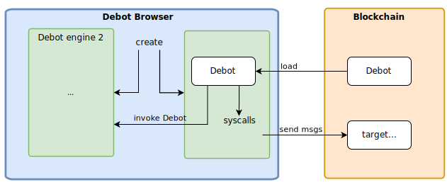
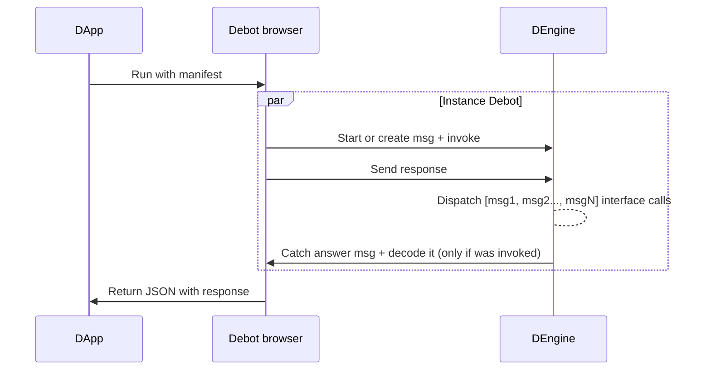

# Specifications

## [Debot](debot.md)

## [Manifest](manifest.md)

```mermaid
sequenceDiagram
    DApp ->> Debot browser: Run with manifest
    par Instance Debot
        Debot browser ->> DEngine: Start or create msg + invoke
        Debot browser ->> DEngine: Send response
        DEngine --> DEngine: Dispatch [msg1, msg2..., msgN] interface calls
        DEngine ->> Debot browser: Catch answer msg + decode it (only if was invoked)
    end
    Debot browser->>DApp: Return JSON with response
```
